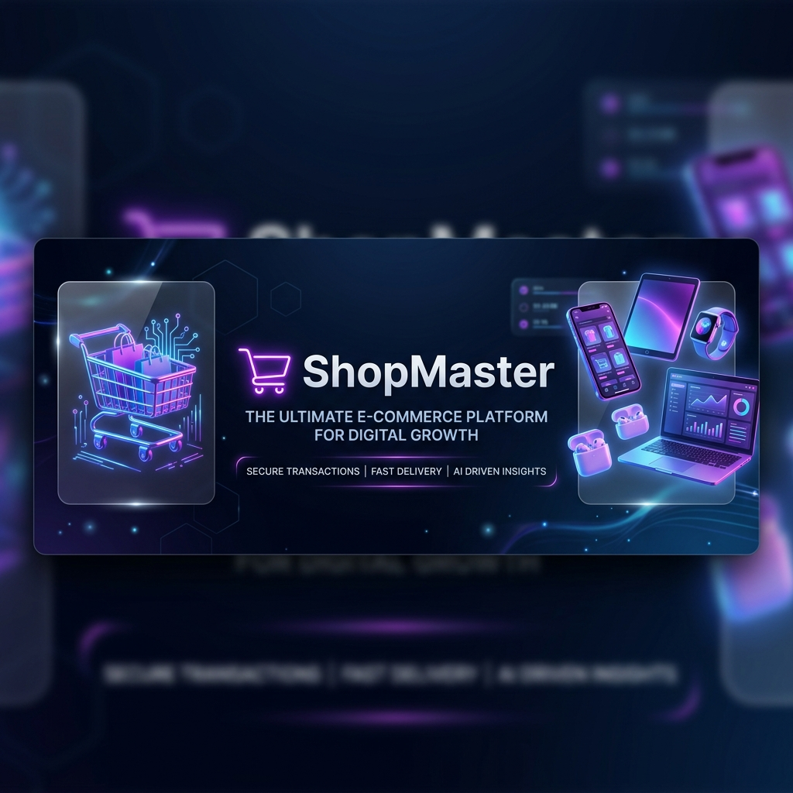

# 🛒 ShopMaster — Premium E-Commerce Experience



<div align="center">

[](https://nextjs.org/)
[](https://reactjs.org/)
[](https://tailwindcss.com/)
[](https://www.prisma.io/)
[](https://next-auth.js.org/)
[](https://www.docker.com/)

---

**ShopMaster** — это современная, высокопроизводительная платформа для электронной коммерции, вдохновленная премиальным "Glossy" дизайном. Построена с использованием последних технологий веб-разработки для обеспечения наилучшего пользовательского опыта и масштабируемости.

[Обзор](#✨-ключевые-особенности) • [Установка](#🚀-быстрый-старт) • [Стек](#🛠-технологический-стек) • [Docker](#🐳-запуск-через-docker)

</div>

---

## ✨ Ключевые особенности

- 💎 **Premium Glossy Design**: Уникальный визуальный стиль с элементами стеклянного морфизма (glassmorphism), плавными градиентами и микро-анимациями.
- 🚀 **Next.js 15 App Router**: Использование серверных компонентов (RSC) и API-роутов для максимальной производительности.
- 🔐 **Безопасная Аутентификация**: Полноценная система логина и регистрации на базе **NextAuth.js** и **bcrypt**.
- 🛒 **Умная Корзина**: Синхронизированная корзина покупок с использованием Context API.
- 📱 **Mobile First & Ultra Responsive**: Идеальное отображение на любых экранах — от компактных смартфонов (320px) до 4K мониторов.
- 🎭 **Динамические Карусели**: Интерактивные слайдеры товаров для повышения вовлеченности пользователей.
- 🌓 **Темная Тема**: Глубокий, проработанный темный режим, снижающий нагрузку на глаза.
- 🛠 **Типизация с TypeScript**: Полный контроль типов для надежности кода.

---

## 🛠 Технологический стек

### Frontend
- **Framework**: [Next.js 15 (App Router)](https://nextjs.org/)
- **Library**: [React 19](https://react.dev/)
- **Styling**: [Tailwind CSS](https://tailwindcss.com/)
- **Icons**: [Heroicons](https://heroicons.com/)

### Backend & Database
- **ORM**: [Prisma](https://www.prisma.io/)
- **Auth**: [NextAuth.js](https://next-auth.js.org/)
- **Database**: PostgreSQL (через Docker-контейнер или локально)

---

## 🚀 Быстрый старт

### 1. Клонирование репозитория
```bash
git clone https://github.com/your-username/shopmaster.git
cd shopmaster
```

### 2. Установка зависимостей
```bash
npm install
```

### 3. Настройка окружения
Создайте файл `.env` на основе примера:
```bash
cp .env.example .env
```
Настройте `DATABASE_URL` и `NEXTAUTH_SECRET`.

### 4. Инициализация базы данных
```bash
# Генерация Prisma Client
npx prisma generate

# Применение схемы к БД (для разработки)
npx prisma db push

# (Опционально) Сидирование базы
npm run db:seed
```

### 5. Запуск
```bash
npm run dev
```
Откройте [http://localhost:3000](http://localhost:3000).

---

## 🐳 Запуск через Docker

Самый быстрый способ развернуть весь стек (Full Stack):

```bash
docker-compose up -d --build
```

**Доступные сервисы:**
- **App**: `http://localhost:3000`
- **PostgreSQL**: `:5432` — База данных
- **Prisma Studio**: `http://localhost:5555` — Визуальный редактор данных

---

## 📂 Структура проекта

```text
shopmaster/
├── prisma/             # Схемы и миграции БД
├── public/             # Статические ассеты и логотипы
├── src/
│   ├── app/            # Страницы и API роуты
│   ├── components/     # Атомарные UI компоненты
│   ├── context/        # Управление глобальным состоянием
│   ├── lib/            # Утилиты и конфигурации (Prisma client)
│   └── styles/         # Глобальные стили (Tailwind)
├── Dockerfile          # Конфигурация образа
└── docker-compose.yml  # Оркестрация контейнеров
```

---

## 📄 Лицензия

Этот проект распространяется под лицензией MIT. Вы вольны использовать его для личных и коммерческих целей.

---
<div align="center">
⭐ Если вам понравился этот проект, поддержите его звездой!
</div>